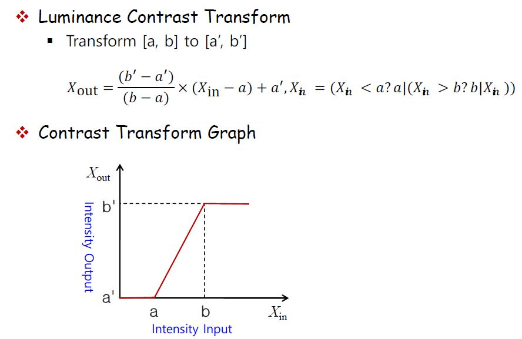

# 컴퓨터 비전

## Contents
- [Camera Geometry](#Camera-Geometry)  
- [Color Transform](#Color-Transform)
- [Image Thresholding](#Image-Thresholding)
- [Image Labeling](#Image-Labeling)
- [Morphology](#Morphology)
- [Box and Gaussian Filtering](#Box-and-Gaussian-Filtering)

## Camera Geometry

Computer Vision System : Scene(3차원 공간)을 빛을 통해 들어온 정보를 이용,  
카메라로 Image를 만들어 낸 다음 Computer로 인식을 하는 System  

**대부분 카메라는 Pinhole 카메라의 수학적 원리와 동일**  

### Pinhole Camera  

물체에 반사된 빛을 하나의 평면에 상이 맺히도록 하려면?  
:point_right: 여러개의 빛이 섞이면 안된다! 하나의 Point에서 하나의 빛만 투영이 되도록 한다.  
 
 

 
 

Aperture(조리개)의 크기는 빛의 파장과 연관이 되어있다. 작으면 작을수록 Blurring이 안 일어나지만 너무 어두워진다.  
Aperture의 크기가 너무 작아도 초점이 맞지않아 흐려진다.  

Pinhole 모델을 사용하게 되면 너무 어두워지는 단점을 **Lens를 사용하여 단점을 보완**한다.  
이상적인 렌즈는 하나의 평면에 한 점에 많은 빛이 모이도록 해준다.  

 

 
 

렌즈를 사용했을 때 나타나는 단점  
1. Spherical Aberration  
2. Chromatic Aberration  
3. Vignette  
4. Radial Distortion and Tangential Distortion  

#### 1. Spherical Aberration  

렌즈가 오목하게 생기기 때문에 생기는 곡률로 인해 중앙에서 생기는 빛의 굴절률과 측면에서 생기는 빛의 굴절률이 다르다.  
:point_right: Non-Spherical Lens(오목하게 생기지 않은 Lens), Multiple Lens(여러 개의 Lens)를 사용하여 빛이 한 점으로 모이도록 해준다!  

 

 
 

#### 2. Chromatic Aberration  

빛의 파장이 색깔마다 각자의 고유값이 있기 때문에 생기는 차이  
:point_right: 카메라의 구조를 바꿔서 해결할 수 있는 문제는 아니다. :cry:  
 
 

 
 

 

 
 

#### 3. Vignette  

다양한 Aperture에 의해 빛이 부분적으로 들어오는 문제점  
이미지의 가운데 부분보다 측면 부분이 어둡게 나오는 것이 문제점이다.   
:point_right: 측면에 좀 더 많은 빛을 투과해주는 식으로 해결  

 

 
 

##### 4. Radial Distortion and Tangential Distortion  

이미지 평면에서 보이는 위치와 실제 위치가 다르게 나타나는 현상  
이상적인 축보다 볼록하게 보이거나 오목하게 보이는 것이 특징이다.  
:point_right: Brown DC Model을 이용하여 보정을 통해 해결  
 
 

 
 

### Projection  

Perspective Projection - 3차원 정보들을 2차원 이미지에 투영하는데 사용하는 기술  

 

 
 

:point_right: 오른쪽 위에 보이는 점 X가 사실 평면 1에 투영되지만  
Aperture(Camera center)의 원점 대칭하여 평면 2에 맺히는 것으로 생각을 한다.  
(좀 더 직관적으로 이해하기 쉽기 때문이다.)

Perspective Projection을 이해하기 전에 Homogeneous 좌표계를 이해해야 한다!  
참고 : [[영상 Geometry #2] Homogeneous Coordinates](https://darkpgmr.tistory.com/78)  

3차원 공간에서 한 점을 (x,y,z)라고 할 때 이것을 Homogeneous로 나타내면 (x,y,z,1)로 나타낼 수 있다.  
이 점 (x,y,z,1)을 이미지 평면에 한 점 (u', v')로 투영시킬 때 어떻게 하는지 알아보자.  

아래 사진에서는 이미지 평면도 Homogeneous Coordinates 표현하면 (u', v', 1) = (U, V, S)로 나타낼 수 있다.  

 

 
 

이 때 이미지 좌표계는 이미지의 중심이 아니라 좌측 상부(or 좌측 하부)이므로 평행이동 값을 고려하여 다시 matrix를 써보면  
(Homogeneous Coordinates를 간략하게 쓸 때 알파벳 위에 ~를 붙여 표시한다.)  

 

 
 
 
 

 
 

Camera 좌표계와 World 좌표계에는 Rotation과 Translation Matrix로 표현할 수 있다.  
이 두개의 Matrix를 **extrinsic camera parameters**이라고 표현한다.  

 

 
 

 [위로](#Contents) / [뒤로](https://github.com/Taeyoung96/Robotics-Summary)   

## Color Transform  

사람 눈에 보이는 가시광선 - 400nm(blue) ~ 700nm(red)  

기본적으로 색을 표현하는 RGB channel은 밝기의 영향에 따라 색도 바뀐다.  
따라서 밝기 변화에 강인한 HSV, YUV 색공간으로 변화 후 처리를 하기도 한다.  

 
 

 

 
 
  
 
 NRG는 Normalized RG의 약자. 다음과 같은 식을 만족하도록 R,G,B 값을 정규화과정을 거친다.  
 

 

  

다양한 색공간이 존재하는 이유는?  
:point_right: 컴퓨터 비전 응용에 따라 밝기 정보를 무시하고 순수한 색공간을 이용하는 경우가 있다.  
:point_right: 응용과 상황에 따라 어떤 색공간을 활용할 것인지 선택해야 한다.  

- Gray : 색 공간 정보를 이용하지 않고 밝기 정보만 이용 (0(Black)~ 255(White))  
- RGB : 가장 기본적인 색상모델, 색을 R(Red), B(Blue), G(Green)의 조합으로 표현  
- HSV : 색을 가장 직관적으로 표현할 수 있는 모델, H(색조 - 색깔의 정도), S(채도 - 색의 진해지는 정도), V(명도 - 밝기)  
- YUV : 색정보를 인코딩할 때 많이 사용하는 색공간 모델, Y(휘도 - 밝기 성분),  U와 V는 크로미넌스(색) 컴포넌트를 대표  

### Contrast  

다른 물체와 배경을 구분할 수 있게 해주는 시각적인 특성의 차이  

- 분산이 작으면 흐릿하게 보이고, 분산이 크면 선명하게 보인다.  

 

  

 

  

Intensity를 Linear하게 변환을 하여 Contrast를 크게 만들면 이미지가 좀 더 선명하게 보일 수 있다.  

 

[위로](#Contents) / [뒤로](https://github.com/Taeyoung96/Robotics-Summary) 

## Image Thresholding

### Image Histogram  

가로축으로 이미지의 픽셀 값, 세로축으로 이미지 픽셀 수를 나타낸 좌표에 이미지 특성을 표시한 것  
히스토그램을 통하여 Intensity의 Frequency Distribution(도수 분포)을 알 수 있다.  

### Image Binarization  

이진화를 하는 이유?  
:point_right: 이미지에서 foreground를 찾아내기 위해서  

이진화가 무조건 되는 것은 아니다.  
대상 이미지가 두 개의 영역으로 서로 다른 색깔로 구분 지을 수 있어야 하고, 각 영역 내에서는 색이 비슷해야 한다.  

그렇다면 이진화를 할 때 Thresholding 값은 어떻게 찾을 것인가?  
:point_right: 히스토그램 분석을 통하여 Threshold 값을 찾아낸다.  

 

  

아래와 같은 히스토그램을 가진 이미지는 이진화를 하기에 적당하지 않다.  

 

  

## Optimal Thresholding  

최적의 Threshold를 찾기 위해서는 식이 필요하다.  

 

  

가장 많이 쓰이는 알고리즘은 **Otsu's Thresholding**이다.  

픽셀 히스토그램을 구한 다음, 평균과 분산을 구한다.  

 

  

모든 t에 대해서 t를 기준으로 class를 두 개로 나눈 후 각각 class의 분산을 구한다.  

 

  

**가장 최적의 Threshold는 Within-class variance를 최소화시켜주는 값이다.**  

또 다른 방법으로는 **Between-class Variance**를 이용해서 최적의 t값을 찾는 방법이 있다.  
Between-class variance는 원래 Clustering에서 주로 사용되던 개념이다.  

Within-class variance를 최소화시키는 것과 Between-class variance를 최대화시키는 것은 같은 의미이다.  

 

  

Between-class variance를 이용해서 최적의 t를 찾는 방법은 다음과 같다.  

 

 

위 그림 2번째 과정에서 Inremental average라는 개념이 나온다. 점화식을 이용하여 평균을 빠르게 구하는 방법이다.  
참고 : [Incremental averageing](https://math.stackexchange.com/questions/106700/incremental-averageing)  

[위로](#Contents) / [뒤로](https://github.com/Taeyoung96/Robotics-Summary) 

## Image Labeling  

이미지 라벨링이란 각각의 성분들로 Binary Image를 분류하고 싶을 때 사용하는 기법이다.  

인접한 픽셀들끼리 연결되어있다는 것을 판단지어아 하는데,  
보통 '4-Neighbors' 방법과 '8-Neighbors' 방법이 있다.  

 

  

왼쪽 상단부터 시작하여 맨 위쪽 pixel들과 맨 왼쪽 pixel들을 제외한 후 (인접한 픽셀 정보(B,C,D)를 확인할 수 없기 때문!)  
규칙에 맞게 인접하게 연결되어 있는지 검사를 한다.  

 

  

'4-Neighbors' 방법일 경우 아래와 같은 규칙을 사용한다.  

 

  

'8-Neighbors' 방법일 경우 아래와 같은 규칙을 사용한다.  

 

  

규칙에 따라 검사를 하다가 애매해지는 경우, **Equivalence table**을 만들어서 서로 같은 Label이라는 것을 알려준다.  

 

  

[위로](#Contents) / [뒤로](https://github.com/Taeyoung96/Robotics-Summary) 

## Morphology  

Morphology란?  
:point_right: Binary image를 좀 더 가공하여 노이즈를 제거하거나 너무 작은 feature들을 없애기 위해 하는 연산이다.  

- Dilation(확장)  
인접한 픽셀에 흰색(foreground) 영역이 있으면 그 부분을 확장 시켜주는 역할을 한다.  
foreground noise는 줄어드는 장점이 있지만, background noise는 증가하는 단점이 있다.  

 

  

- Erosion(축소)  
인접한 픽셀(마스크 영역 내에 있는 픽셀)이 모두 흰색(foreground) 영역이 있으면 foreground로 유지를 하고 그렇지 않을 경우 제거(background)한다.  
background noise는 줄어드는 장점이 있지만, foreground noise는 증가하는 단점이 있다.  

 

  

Morphology 연산자도 여러 가지 법칙들이 성립한다.  

 

  

 

  

### Opening & Closing  

- Opening : erosion 연산을 먼저 한 후, dilation 연산을 진행하여 background noise를 제거하는데 효과적인 연산이다.  

 

- Closing : dilation 연산을 먼저 한 후, erosion 연산을 진행하여 foreground noise를 제거하는데 효과적인 연산이다.  

 

  

### Boundary Extractor  

Morphology 연산과 집합을 이용하여 경계를 추출하는 알고리즘을 만들 수 있다.  
1. 기존 이미지에서 erosion 연산을 진행한 이미지를 빼주게 되면 경계 부분만 남는다.  

 

  

2. Dilation 연산을 진행한 이미지에서 기존 이미지를 빼주게 되면 경계 부분만 남는다.  

 

  

아래의 이미지는 Boundary Extractor를 사용한 예시이다.  
- a는 원본 binary image  
- b는 첫번째 방법을 이용하고 mask를 4-neighbor 형태의 mask를 사용한 경우  
- c는 첫번째 방법을 이용하고 mask를 8-neighbor 형태의 mask를 사용한 경우  
- d는 두번째 방법을 이용한 경우  

 

  

[위로](#Contents) / [뒤로](https://github.com/Taeyoung96/Robotics-Summary)  

## Box and Gaussian Filtering

### Convolution  

Input 신호에 대한 선형 결합(Linear Combination)  

 

  

f(x)를 원신호, h(x)를 kernel 또는 mask 또는 window라고 부른다.  

**Convolution의 속성**  
1. 교환법칙  
2. 결합법칙  
3. Cascade system을 만들 수 있다.  

**Discrete Convolution으로 연산을 수행할 때, 1D convolution 2번 수행한 결과가 2D convolution 1번 수행한 것 보다 Complexity가 낮다.**  

### Image Noise Model 

모든 이미지에는 노이즈가 존재한다. :point_right: 여러 가지 필터를 이용해서 Noise를 제거한다.    
인접한 픽셀에는 intensity에 대한 정보가 포함될 수 밖에 없다.  

1. Gaussian Noise - 평균이 0 , 분산이 sigma일 때 Gaussian distribution을 따르는 noise  

 

  

2. Salt-and-pepper Noise - 마치 이미지에 소금과 후추를 흩뿌린것 처럼 나타나는 Noise, 그 확률은 Uniform distribution을 따른다.    

 

  

 

  

### Box Filtering  

Box Filtering이란?  
:point_right: 인접 픽셀의 평균 값과 동일한 값을 갖는 공간 도메인 선형 필터  

**Box filtering의 특징**  

- 이미지에 Blur 현상을 일으킬 수 있다.  
- 계산 속도가 빠르다. (가우시안 필터와 비교를 했을 때)  
- Salt & pepper noise를 제거하지 못한다.  
- Filtering 후, High frequency의 신호가 남아있다.  

❗ 이미지를 주파수 영역으로 도메인을 바꿔서 보면, high frequency의 주파수 일수록 노이즈일 확률이 높다.  

### Gaussian Filtering  

Gaussian Filtering이란?  
:point_right: 가우시안 필터는 임펄스 응답이 가우시안 함수인 필터  
:point_right: 현재 픽셀값과 주변 이웃 픽셀값들의 가중 평균(weighted average)을 이용해서 현재 픽셀의 값을 대체  

2D Gaussian은 1D Gaussian filter 2개로 분리해서 계산할 수 있다. 이렇게 해야 Compliexity가 줄어들고 계산속도가 빠르다.  

 

Sigma의 값이 크면 클수록 Blur 현상이 더 심해진다.  

**Gaussian Filtering의 특징**  

- Filtering 후, Low frequency만 남길 수 있다. - truly low-pass filter  
- Sigma의 값이 클 수록, 이미지의 Blur 현상이 더 심해진다.  
- 노이즈를 제거하는데 보통 사용하는 Filter이다.  

[위로](#Contents) / [뒤로](https://github.com/Taeyoung96/Robotics-Summary) 

