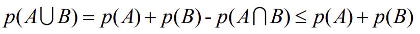
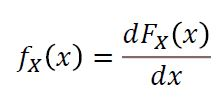
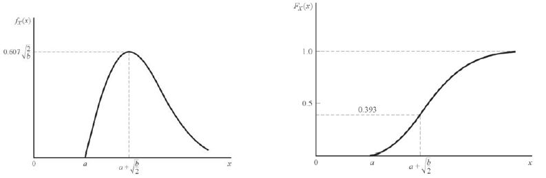

# 확률 및 랜덤 프로세스  

## Contents
- [Definitions of Probability](#Definitions-of-Probability)  
- [The Random Variable](#The-Random-Variable)

## Definitions of Probability  

확률의 기본적인 용어를 정리하고 확률의 정의에 대해서 알아보자.  
- 집합 : Set  
- 부분 집합 : Subset - 원소의 갯수가 N개일 때, 가질 수 있는 부분집합의 갯수 2^n개  
- 진부분집합 : Proper subset (부분집합 중 A = B가 아닌 다른 부분집합, 출처 : [위키백과](https://ko.wikipedia.org/wiki/%EB%B6%80%EB%B6%84%EC%A7%91%ED%95%A9))  
- 상호 베타적인 관계 : Disjoint or Mutually exclusive (두 집합의 관계에서 공통된 원소가 존재하지 않을 때)  
- 주어진 상황에서 가장 큰 집합 : Universal Set  

### 집합을 구분하는 방법  

**Countable vs Uncountable**  

- Countable : 원소들이 자연수와 일대일 대응이 가능한 집합  
- Uncountable : 원소들이 자연수와 일대응 대응이 되지 않는 집합  
- Empty : 원소가 없는 집합 (= null set), **주의, A = {0}은 empty set이 아니라 원소가 0인 집합**  

**Finite vs Infinite**  

- Finite : 집합이 비어있거나, 원소의 갯수가 유한할 때(셀 수 있을 때)  
- Infinite : 원소의 갯수가 무한할 때(셀 수 없을 때)  

Ex ) 정수의 집합을 Z라 할 때, 이 집합은 Countable, inifinite  
(자연수의 집합으로 정수의 집합과 일대응 대응이 가능하고, 원소의 갯수를 셀 수 없다.)  
유리수의 집합 Q라 할 때, 이 집합은 Countable, infinite  
실수의 집합 R이라 할 때, 이 집합은 Uncountable, infinite  

---  

### 집합 기호

- 합집합 : Union (= sum)  
- 교집합 : Intersection (= product) - mutually exclusive일 때 교집합은 공집합이다.  
- 여집합 : Complement  
- 집합의 연산 법칙 (벤 다이어그램으로 증명)  
    1. 교환 법칙 (The commutative law)  
    2. 분배 법칙 (The distributive law)  
    3. 결합 법칙 (The associatove law)  
    4. 드모르간 법칙 (De Morgan's law)  
    5. 쌍대성 원리 (Duality principle) - 참고 : [쌍대성](https://gazelle-and-cs.tistory.com/17)  

### 확률의 정의  

- 이론에 의한 정의
- 실험을 통한 상대적인 빈도수에 의한 정의  
- Sample space S : 실험을 통해 나올 수 있는 모든 경우의 수 (Discrete and continous sample spaces)  
- Event : sample space의 부분 집합  
- 확률 : **어떤 Sample sapce S에서 event가 발생할 수 있는 가능성 (확률은 함수로 정의)** - Relative frequency ([상대 도수](https://m.blog.naver.com/PostView.nhn?blogId=mathfiend&logNo=220507086937&proxyReferer=https:%2F%2Fwww.google.com%2F))를 이용하여 정의할 수 있다.  
- 만족해야 하는 3가지 법칙  

 

 
 

  
- 실험을 통한 수학적 모델  

 

 
 

- Joint probability : A의 event와 B event가 동시에 일어날 확률 = (A와 B 교집합이 일어날 확률)  
 
 

 
 

 
 A와 B가 Mutually exclusive 관계일 때 위 그림에서 등호가 성립한다.  

- **조건부 확률 (Conditional probability)** - Event B가 일어날 확률이 0보다 클 때, Event A가 일어날 확률을 Event B가 일어날 확률을 고려하여 구하는 확률  
 

 
 
 
 
 - 만족하는 3가지 법칙

 
 
 - 대표적인 조건부 확률 문제 : [몬티홀 문제 설명 블로그](https://tali.tistory.com/1113)  

- 전체 확률의 법칙 (Total probability) : 조건부 확률로부터 조건이 붙지 않은 확률을 계산할 때 사용  

 

위와 같은 조건을 만족해야한다.  

 

- **베이지안 확률 (Bayes’ theorem)** : p(B_n) 과 𝑝(𝐴|𝐵) 을 알고 있다고 할 때, 다음과 같은 식이 성립한다.  

 

베이즈 정리는 근본적으로 사전확률과 사후확률 사이의 관계를 나타내는 정리이다.  

- 참고자료 : [베이즈 정리의 의미](https://angeloyeo.github.io/2020/01/09/Bayes_rule.html)  

### Independen Events & Combined Experiments  

- 독립 사건 (Independent Event) : 𝑝(𝐴) ≠ 0 𝑎𝑛𝑑 𝑝(𝐵) ≠ 0 일 때,  
𝑝(𝐴|𝐵) = 𝑝(𝐴), 𝑝(𝐵|𝐴) = 𝑝(𝐵), 𝑝(𝐴 ∩ 𝐵) = 𝑝(𝐴)𝑝(𝐵)를 만족한다.  

- Multiple events : N개의 events에서 Multiple events의 경우의 수는 2^n - N - 1이다.  
(N은 하나만 뽑는 갯수, 1은 아무것도 안 뽑는 갯수)

- Combined Experiments : 개별적인 실험을 결합하여 하나의 실험으로 간주할 때 사용 Ex) 2차원 좌표평면  
    보통 'x'를 이용하여 표기 **곱하기와 표기가 같으므로 혼동 주의!**  

- Permutations (순열) : 여러번 시도를 해서 순서가 중요한 경우  

 

- Combinations (조합) : 여러번 시도를 해서 순서가 중요하지 않은 경우  

 

- Bernoulli Trials (베르누이 시행) : 임의의 실험에서 결과가 '성공' 아니면 '실패' 둘 중 하나인 것  
    이항정리와 비슷하다고 생각하면 이해하기 쉽다.  

이항 계수는 다음과 같은 식으로 정리할 수 있다.  

  

베르누이 시행을 식으로 정리하면 다음과 같다.  

 

 [위로](#Contents) / [뒤로](https://github.com/Taeyoung96/Robotics-Summary)   

## The Random Variable  

### Random Variable의 정의  

어떠한 표본 Sample space S의 있는 값들을 다른 공간(line)으로 Mapping시켜주는 함수  
**S에 있는 모든 점들은 무조건 일대일 대응이 되어야 한다.**  

- {X ≤ x} : 랜덤 변수 X가 숫자 x를 초과하지 않는 표본 공간의 점 s에 해당  
- Discrete하게 될 수도 있고, Continous하게 될 수도 있다. 물론 Mixed(Discrete + Continous)하게 될 수도 있다.  

### Distribution Function  

Cumulative distribution function (누적 분포 함수) : 누적 분포 함수는 주어진 확률 변수가 특정 값보다 작거나 같은 확률을 나타내는 함수  

Distribution function이 가지는 특성  

 

 

**만약 X가 Discrete random variable이라면,**  
Distribution function은 step function 모양으로 나타나게 된다.  

 

 

**만약 X가 Continous random variable이라면,**  
Distribution function은 직선 모양으로 나타나게 된다.  

 

### Density Function  

Density function이란 Distribution function을 x로 미분한 값  

 

미분이 불가능할 때에도 Density function을 구해야 하기 때문에 unit step function을 이용해서 표현하기도 한다.  

만약, CDF(Cumulative distribution function)가 아래와 같이 정의되어 있다면  

 

PDF(Probability density function)은 아래와 같이 정의할 수 있다.  

Density function은 다음과 같은 특성을 가진다.  

### Gaussian Random Variable  

다음과 같은 Density function을 만족하는 Random Variable X를 **Gaussian**이라고 부른다.  

적분을 구해 CDF(Cumulative distribution function)를 구하는 것이 일반적이지만 적분이 쉽지 않으므로 **표준화 과정**을 거쳐 구한다.  

  

또 다른 방법으로 CDF를 구할 때, Q-function을 이용해서 구하기도 한다. (추천하는 방법은 아님)  
Q-function은 정확하게 적분을 할 수 없지만 근사화가 가능하다.  

  

  

### Other Distribution and Density examples 

Gaussian이 가장 대표적이긴 하지만 여러 형태의 Distribution function이 존재한다.  

**Discrete한 Random Variable일 때,**  

1. Binomal  

이항 분포(Binomial distribution)는 연속된 n번의 독립적 시행에서 각 시행이 확률 p를 가질 때의 이산 확률 분포이다.  
왼쪽이 PDF, 오른쪽이 CDF에 대한 함수이다.  

  

2. Poisson

푸아송 분포(Poisson distribution)는 단위 시간 안에 어떤 사건이 몇 번 발생할 것인지를 표현하는 이산 확률 분포이다.  
왼쪽이 PDF, 오른쪽이 CDF에 대한 함수이다.  

  

**푸아송 분포는 이항 분포의 특수한 형태이다!**  

이항분포를 따르는 위와 같은 확률변수 X에서, n이 대단히 크고 p가 대단히 작을 경우, 이 확률변수 X는 λ=np인 푸아송 분포로 근사할 수 있다.  

**Continous한 Random Variable일 때,**  

3. Uniform  

균일 분포(Uniform distribution)은 모든 확률 변수에 대해 균일할 확률 분포를 가지고 있는 연속 확률 분포이다.  
주로 아날로그 회로를 디지털로 변환할 때 많이 쓰인다.  

왼쪽이 PDF, 오른쪽이 CDF에 대한 함수이다.  

  

  

4. Exponential  

지수 분포(Exponential distribution)는 사건의 횟수가 푸아송 분포를 따른다면, 다음 사건이 일어날 때까지 대기 시간이 따르는 연속 확률 분포이다.  
왼쪽이 PDF, 오른쪽이 CDF에 대한 함수이다.  

 

  

5. Rayleigh  

레일리 분포(Rayleigh distribution)는 예를 들어 2차원 벡터의 직교 성분이 정규 분포일 경우, 벡터의 크기가 나타내는 연속 확률 분포이다.  
주로 bandpass filter를 설계할 때 많이 쓰인다.  

  

  

### Conditional Distribution and Density Functions  

조건부 확률이 나왔을 때 PDF(Probability density function)와 CDF(Cumulative distribution function)를 구해보자.  

- B라는 상황이 주어졌을 때, x가 X보다 작을 확률을 구해보면,  

  

Conditional Distribution의 특징은 다음과 같다.  

  

Conditional density function은 기존에 배웠던 Density function에서 조건부 확률 개념만 추가한 개념이다.  

  

이에 대한 특성은 다음과 같다.  

  

Conditional distribution과 Density function을 그래프로 그려보면 다음과 같다.  

  

[위로](#Contents) / [뒤로](https://github.com/Taeyoung96/Robotics-Summary)   
