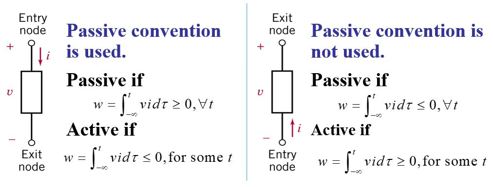
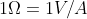
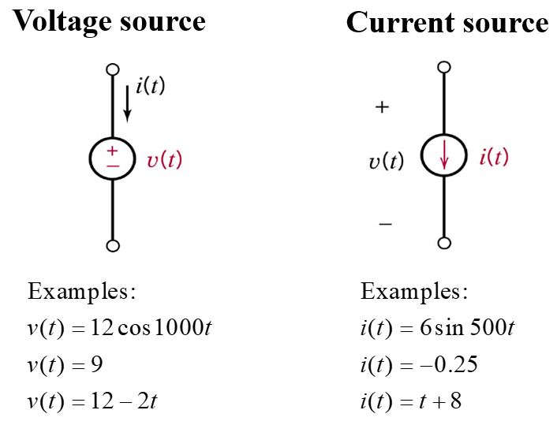
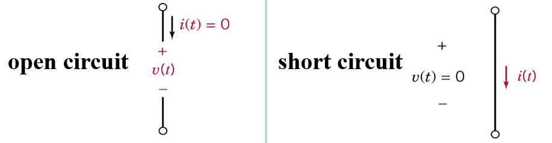
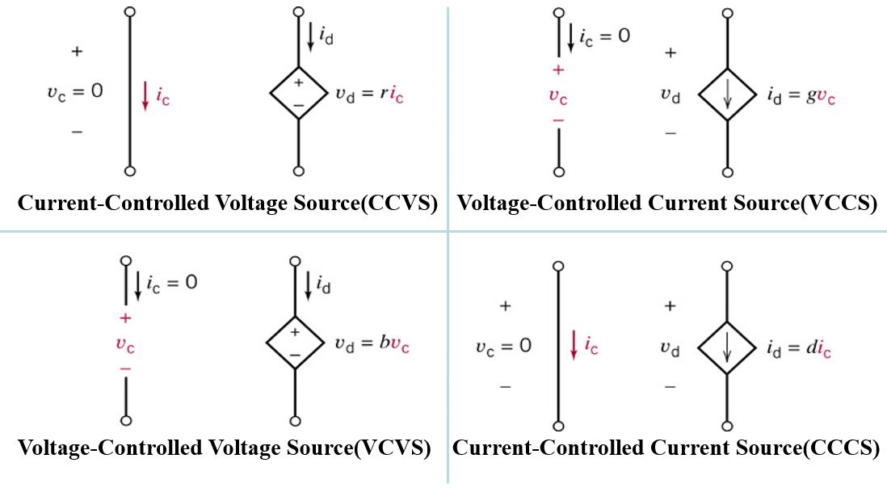
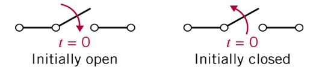

# 회로 이론

## Contents  
- [Circuit Elements](#Circuit-Elements)
- [Resistive Circuits](#Resistive-Circuits)  
- [Nodal and Loop Analysis](#Nodal-and-Loop-Analysis)  
- [Op AMP](#Op-AMP)
- [Circuit Theorems](#Circuit-Theorems)  
- [Capacitors and Inductors](#Capacitors-and-Inductors)  
- [First and Second Order Transient Circuits](#First-and-Second-Order-Transient-Circuits)  
- [AC Steady-State Analysis](#AC-Steady-State-Analysis)  
- [Steady-State Power Analysis](#Steady-State-Power-Analysis)  
- [Magnetically Coupled Networks](#Magnetically-Coupled-Networks)  

## Circuit Elements

- 전하 : 전자기장내에서 전기현상을 일으키는 주체적인 원인, 단위는 쿨롱(C)  
- 전류 : 시간에 따른 전하의 변화량, 단위는 암페어(A) - 1A = 1 C/s     
- 전압 : 회로의 두 지점 사이의 전위차, 단위는 볼트(V) - 1V = 1 J/C  
  **하나의 지점에서 상대적인 전위차로 전압의 +/- 를 결정**한다.  
- 파워 : 단위 시간 당 에너지, 단위는 와트(W) - 1W = 1 J/s  
  ❗ **P = V x I**  
- 수동소자 / 능동소자  
  - 수동소자 : 공급된 전력을 소비하는 소자 - Example) 저항, 캐패시터, 인덕터  
  - 능동소자 : 전력을 공급하는 소자  
  

  
  
  

- 저항 : 전하의 흐름을 방해하는 물질, 단위는 옴  
  ❗   
- Independent Sources vs Dependent Sources  
  - Independent Sources : 회로에 전류에너지를 독립적으로 공급하는 것  
  

  
  
  
  ❗ 이상적인 상황일 때 Open Circuit - 전류 = 0, Short Circuit - 전압 = 0   
  

  
  
  
  
   - Dependent Sources : 다른 Independent Sources에 영향을 받아 전류에너지를 공급하는 것  
  

  
  

 
 - 스위치 : ❗ 회로에 스위치가 나오면 시간을 나누어 문제를 풀자 (초기 상태 주의!)  
  

  
  
 

[위로](#Contents) / [뒤로](https://github.com/Taeyoung96/Robotics-Summary)   

## Resistive Circuits

## Nodal and Loop Analysis

## Circuit Theorems  

## Op AMP  

## Capacitors and Inductors

## First and Second Order Transient Circuits

## AC Steady-State Analysis  

## Steady-State Power Analysis  

## Magnetically Coupled Networks

